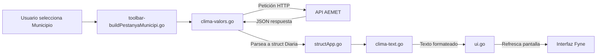
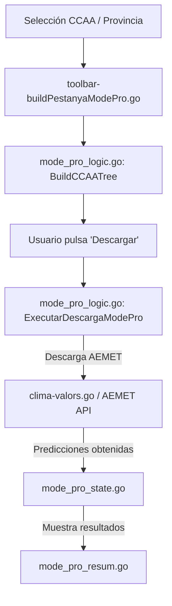
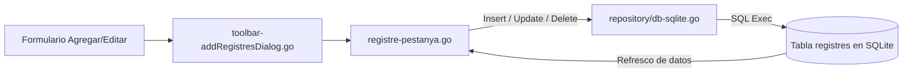

# 🌱 EcoHortApp

**EcoHortApp** es una aplicación de escritorio y web desarrollada en **Go** y **Fyne**. Su objetivo es proporcionar información meteorológica en tiempo real y predicciones oficiales de la **AEMET** (Agencia Estatal de Meteorología) para la gestión y optimización de huertos ecológicos.

---

## 🔑 Configuración de la API Key de AEMET

Para obtener datos meteorológicos de la AEMET, es necesaria una clave gratuita que se puede solicitar en [AEMET OpenData](https://opendata.aemet.es/).

La clave se puede configurar de dos formas:

1. **Desde la interfaz gráfica (Usuarios finales):**
   * Abre la aplicación y haz clic en **Preferencias (⚙️)**.
   * Entra en la pestaña **Mode PRO**, pega tu clave y haz clic en **Guardar**.

2. **Mediante archivo `.env` (Desarrolladores / Entorno local):**
   * Copia o renombra el archivo `.env.example` a `.env`.
   * Añade tu clave en la variable: `AEMET_API_KEY=tu_clave_aqui`.

---

## 🚀 Características principales

* 🌤️ **Monitoreo meteorológico:** Consulta de datos climáticos y pronósticos detallados.
* 📍 **Conversión geodésica y parseo inteligente:** Soporte integral para 4 formatos de coordenadas de AEMET (DMS, sexagesimales compactas, decimales directos y métricas UTM Huso 30N) estandarizadas automáticamente a WGS84 para mapas y meteogramas.
* ⚙️ **Sistema de Ajustes Dual (Pestañas):**
  * 📍 **Per Municipi:** Búsqueda rápida y sincronizada por **Nombre** o **Código INE/AEMET**.
  * ⚡ **Mode PRO:** Filtro jerárquico masivo con selección en cascada por **Comunidades Autónomas y Provincias**.
* ⚡ **Consultas concurrentes:** Descargas asíncronas optimizadas mediante Goroutines y semáforos de red.
* 💾 **Persistencia local en SQLite:** 
  * Almacenamiento desacoplado mediante el patrón **Repository** sin necesidad de servidor externo.
  * Operaciones CRUD completas para el historial manual de registros meteorológicos.
  * Sistema de **caché local en disco** (`municipios_cache.json`) para la lista de maestros de AEMET, reduciendo la latencia de inicio y garantizando protección contra límites de tasa de peticiones (HTTP 429).
* 🎨 **Interfaz adaptable:** Diseñada con la librería gráfica Fyne (compatible con Windows, Linux, macOS y WebAssembly).

---

## 🗄️ Arquitectura de Base de Datos (SQLite)

El almacenamiento persistente está gestionado por la implementación `SQLiteRepository` (`repository/db-sqlite.go`). La inicialización automatizada de esquemas se ejecuta a través del método `Migrate()`:

### 1. Tabla `registres` (Histórico Manual / CRUD)
Permite gestionar las lecturas introducidas manualmente por el usuario:
- `id` (INTEGER PRIMARY KEY AUTOINCREMENT)
- `data_registre` (INTEGER NOT NULL - Unix Timestamp)
- `precipitacio` (INTEGER NOT NULL)
- `temp_maxima` (INTEGER NOT NULL)
- `temp_minima` (INTEGER NOT NULL)
- `humitat` (INTEGER NOT NULL)

### 2. Tabla `prediccions` (Estructura para Mode PRO)
Almacena las predicciones meteorológicas diarias de AEMET:
- `codi_ine` (TEXT NOT NULL) - Código INE del municipio.
- `data_prediccio` (INTEGER NOT NULL - Unix Timestamp)
- `prob_precipitacio` (INTEGER NOT NULL DEFAULT 0)
- `temp_maxima` (INTEGER NOT NULL DEFAULT 0)
- `temp_minima` (INTEGER NOT NULL DEFAULT 0)
- `humitat_relativa` (INTEGER NOT NULL DEFAULT 0)
- `created_at` (INTEGER NOT NULL - Unix Timestamp)
- **PRIMARY KEY (`codi_ine`, `data_prediccio`)**

---

## 🏗️ Estructura del Proyecto

### 📌 Núcleo e Interfaz Principal
* **`main.go`**: Punto de entrada e inicialización de la aplicación.
* **`structApp.go`**: Definición centralizada de las estructuras de datos (`Config`, `UserConfig`, `Diaria`, `Municipio`, etc.).
* **`ui.go`**: Construcción del layout principal y orquestación del refresco de vistas (`actualitzarClimaDadesContent`).
* **`config.go`**: Carga, guardado y persistencia de las preferencias de usuario (`config.json`).
* **`db.go`**: Conexión e inicialización del controlador SQLite3.
* **`bundled.go`**: Recursos e imágenes empaquetados directamente en el ejecutable.
* **`repository/`**: Capa de abstracción de datos (Patrón Repository).
  * **`repository/repository.go`**: Interfaz central `Repository` y estructura `Registres`.
  * **`repository/db-sqlite.go`**: Implementación en SQLite3 con soporte de migración y operaciones CRUD.

### 🌤️ Servicio Meteorológico, Geodesia & Gráficos
* **`coord_parser.go`**: Parser multiformato para procesar y validar cadenas de coordenadas geográficas de AEMET.
* **`geo_utm.go`**: Módulo geodésico matemático para la conversión de coordenadas UTM (Huso 30N) a WGS84.
* **`clima-valors.go`**: Peticiones HTTP a AEMET y procesado de predicciones (`GetPrediccions`, `GetPreUrl`, `GetPrediccio`).
* **`clima-text.go`**: Formateo e interpretación de los datos del clima para las etiquetas textuales.
* **`aemet_maestros.go`**: Descarga, filtrado, mapeo de CCAA y gestión de la caché local en disco (`municipios_cache.json`).
* **`aemet-client.go`**: Cliente HTTP auxiliar para la conexión con las APIs externas.
* **`pronostic-pestanya.go`**: Renderizado de la pestaña visual del tiempo (gráfico de Meteoblue).

### 🛠️ Componentes de Mode PRO e Interfaz
* **`mode_pro_logic.go`**: Lógica para la construcción del árbol jerárquico (CCAA/Provincias) y ejecución masiva de descargas.
* **`mode_pro_state.go`**: Gestor de estado en memoria para los municipios seleccionados en el Mode PRO.
* **`mode_pro_resum.go`**: Vista del resumen y desglose de las descargas ejecutadas.
* **`registre-pestanya.go`**: Pestaña de historial de datos con vista de tabla CRUD.
* **`toolbar.go`**: Construcción de la barra de herramientas superior.
* **`toolbar-buildPestanyaMunicipi.go`**: Pestaña de selección de municipio por búsqueda rápida de nombre o código.
* **`toolbar-buildPestanyaModePro.go`**: Pestaña de filtrado por CCAA/Provincia y ajuste de API Key.
* **`toolbar-mostrarPreferencies.go`**: Ventana modal de preferencias globales.
* **`toolbar-addRegistresDialog.go`**: Diálogo modal para introducir manualmente nuevos registros climáticos.

---

## 🔄 Flujo de Datos y Conexión entre Ficheros

### 1. Flujo de Consulta Meteorológica Individual (Pestaña Municipi)



### 2. Flujo de Descarga Masiva (Mode PRO)



### 3. Flujo de Gestión Manual (CRUD Registres)



---

## 🛠️ Requisitos e Instalación

1. **Tener instalado Go** (versión 1.22 o superior).
2. Clona o descarga este repositorio en tu equipo.
3. Configura la clave de API de AEMET (mediante `.env` o en la interfaz gráfica).

---

## 💻 Ejecución

Ejecuta la aplicación desde la terminal con:

```bash
go run .
```

---

## 📦 Compilación

Para generar el ejecutable binario para distribución:

```bash
# Windows (sin consola de comandos al abrir)
go build -ldflags="-H windowsgui" -o EcoHortApp.exe .

# Linux / macOS
go build -o EcoHortApp .
```