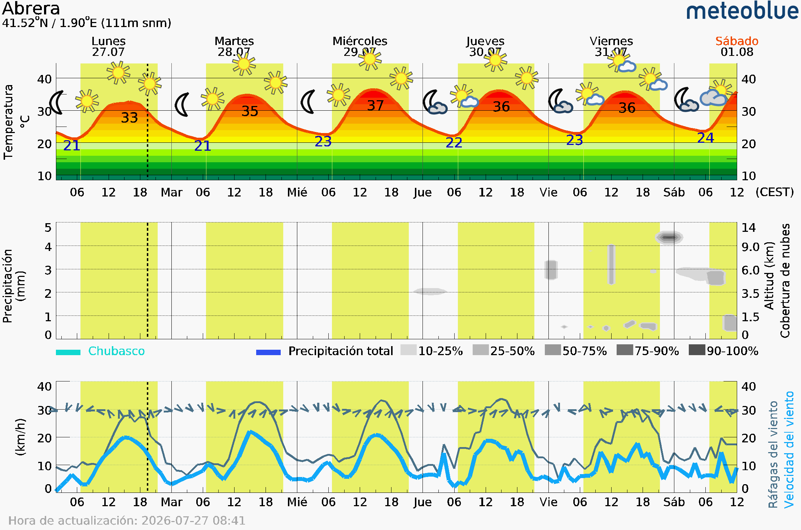

# 🌱 EcoHortApp

**EcoHortApp** es una aplicación de escritorio y web desarrollada en **Go** y **Fyne**. Su objetivo es proporcionar información meteorológica en tiempo real y predicciones oficiales de la **AEMET** (Agencia Estatal de Meteorología) para la gestión y optimización de huertos ecológicos.

---

## 🚀 Características principales

* 🌤️ **Monitoreo meteorológico:** Consulta de datos climáticos y pronósticos por municipio.
* 🗺️ **Selección flexible de ubicación:** Soporte para selección única por municipio o selección múltiple masiva por CCAA y Provincias.
* ⚡ **Consultas concurrentes:** Descargas asíncronas optimizadas mediante Goroutines y semáforos de red.
* 💾 **Persistencia de datos:** Guardado automático de configuraciones en formato JSON local (`config.json`).
* 🎨 **Interfaz adaptable:** Diseñada con la librería gráfica Fyne (compatible con Windows, Linux, macOS y WebAssembly).

---

## 🛠️ Requisitos e Instalación

1. **Tener instalado Go** (versión 1.22 o superior).
2. Clona o descarga este repositorio en tu equipo.
3. Asegúrate de configurar la clave de API de AEMET en el archivo `.env`:

```env```

AEMET_API_KEY=tu_clave_aqui


## 🏗️ Estructura del Proyecto

* `main.go`: Punto de entrada de la aplicación.
* `config.go`: Gestión de carga y guardado de preferencias del usuario (`config.json`).
* `ui.go`: Diseño de la pantalla y contenedores principales de la interfaz gráfica.
* `toolbar.go`: Ventana modal de ajustes y configuración de municipios.
* `clima-valors.go`: Peticiones HTTP y lógica de descarga de datos de AEMET.
* `clima-text.go`: Formateo e interpretación de datos meteorológicos.

Al ejecutar la aplicación desde la terminal con: go run .


